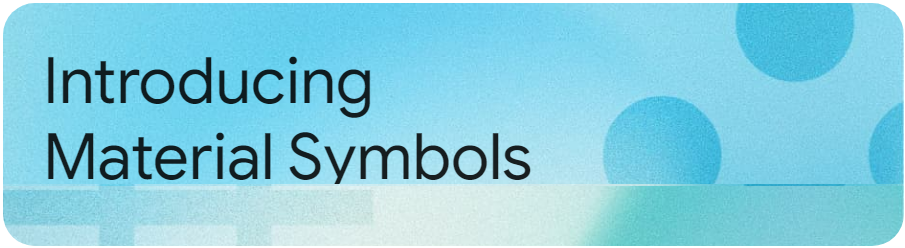

# Welcome to the Material Design Library Html

👋 Welcome to the official repository of the Material Design Library Html! We're thrilled to introduce you to our powerful and versatile software plugin, meticulously crafted by our talented team of software engineers. Whether you're a developer, designer, or an enthusiast, this plugin aims to enhance your experience by bringing a new dimension to your workflow.

## What is the Material Design Library Html?

Google Material Design is a design language and library that you can use for modern and stylish web designs. If you want to create a header on a website using Google Material Design, you can follow the steps below using HTML and CSS.
